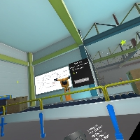

# Rule Goldberg Game for HTC VIVE by Tiago Silva
## [Udacity's VR Developer Nanodegree course](https://www.udacity.com/course/vr-developer-nanodegree--nd017) - Term 3 Project 1

## How long it took
It took approximately a week of full time work to complete.

## What did I learn?
This was my fisrt project for HTC Vive and it was quite challenging
- Handling SteamVR v2 new interface
- Grabbing and throwing objects
- Writing anti-cheat scripts
- VR Game design with 6 Degrees of freedom
- Design Menu UIs
- Create scripts for interactive objects like a fan, trampoline, a wood plank with a teleport point and ball portal entry and exit
- Scene loadings
- Review the course past projects

## Project Perks
- I think the levels are quite challenging.
- I did my best so you could not cheat on the game (except on one thing)

## Final thoughts on the game
I wish I had more time to dwell on the project. I got stuck a couple of times because I did not understand clearly how the SteamVR scripts worked, and how I could not let someone grab a ball whie out of the platform.
I particularly liked designing the game objects, I had a lot of fun with the fan and the portals.
I write a list of Improvements for the future, because I think the game could have a lot more potential and be more fun for the players.

## Improvements for the future
- Add particles to the fan to display wind direction.
- Make Rule Goldberg objects Steam VR Throwable objects but without velocity. I did not change this due to lack of time.
- A player while on a wood plank can grab it and basically levitate. There is no script in SteamVR displaying you are in a teleport point.
Because of that, I believe the only option to stop this would be to create a class with the configurations of a Teleport Point, and when the player is about to get there, a boolean like PlayerIsOnPlank you'd be turned on and not let the player grab the wood plank he is standing on.
I tried with triggers and colliders but that way it was a mess (if you had many wood planks close to each other you would not be able to grab them.)
- Create animations for conveyors to move when a button would be pressed, and robotic arms to swing around as well in level 3 and 4.

## Versions
- SteamVR 1.2.7
- Unity 2017.4.15f1